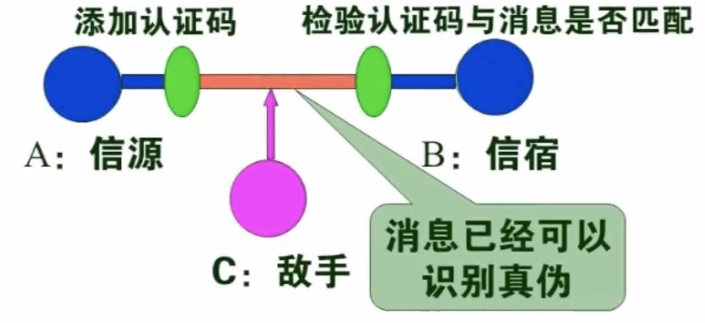

# 密码学概述

## 一、密码学的基本目标

### 1.1 攻击

通信模型又“信源”和“信宿”组成，信源通过公开的信道将数据发送给信宿，信息在经过公开信道的过程中，可能被“敌手”攻击，攻击的方式如下

- 被动攻击（窃听）
获取但不改变传输的信息

- 主动攻击
不仅窃听，而且改变传输的信息，目的是实现伪造和欺骗

### 1.2 密钥学涉及的技术以及解决的问题

- 加密技术

我们暂且不考虑主动攻击信道的情况，怎样对抗窃听技术，就需要采取我们今天要讨论的机密技术。

当信源需要将信息传输给信宿的时候，我们需要将数据进行加密，通过信道传输给信宿，对方收到加密的结果之后，利用相应的解密（脱密）算法进行解密（脱密），获取相应的信息。而敌手只能在信道上获取加密过的信息，消息一经变得“面目全非”，攻击者无法进行攻击。

密码学要解决的第一个基本问题，就是信息机密性问题，即解决信息的传输保密和存储保密的问题。

- 认证技术

信息认证的过程是信源将信息传给信宿的时候，添加上认证码，信宿到得到信息的时候再检验认证码是否匹配。如果敌手在信道上做数据修改，则防止敌手在信道上对数据进行修改。如下图

密码学要解决的第二个基本问题，就是信息的真实性问题，即能检测出主动攻击。主要对一下内容进行认证：（1）发送者的身份；（2）接受者的身份；（3）内容的真伪；（4）时间的真伪。

- 对抗抵赖的技术

> 进度 01 04:00

## 二、密码学的主要分支

## 三、加密算法的一些基本概念

## 四、最基本的破译方法--枚举攻击

## 三、最基本的三个编码技术
